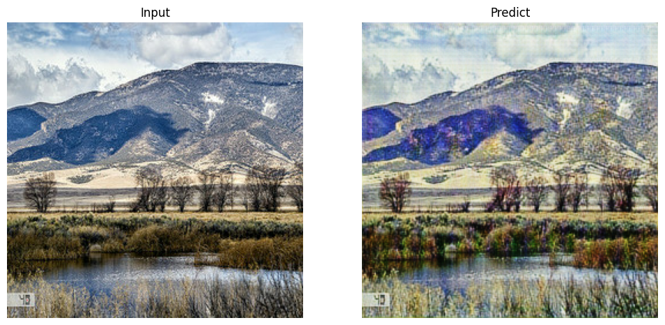
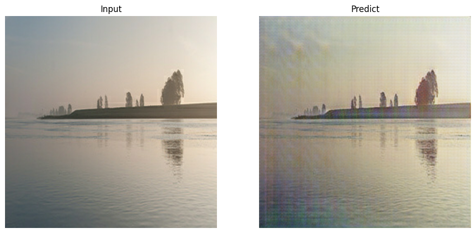
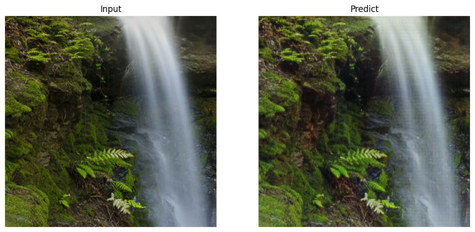
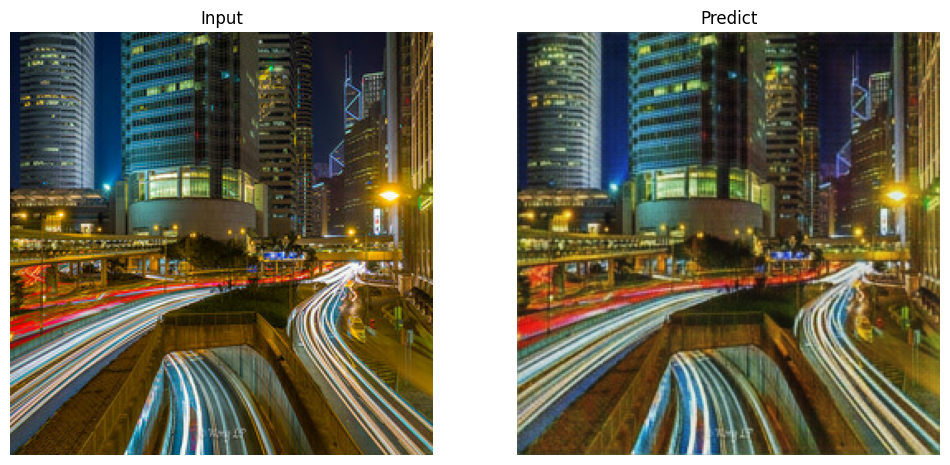

# CycleGAN

This is my 5th week assignment in CU Boulder intro deep learning class.

We build CycleGAN to make monet-tique images from photos.

We assume this notebook runs on kaggle notebook. The original kaggle competision is [here](https://www.kaggle.com/competitions/gan-getting-started). You can get the same dataset as we use from competition page.

### Files and Folders
* [gan.ipynb](./gan.ipynb): Jupyter Notebook containing the data analysis and model building code
* [gan.pdf](./gan.pdf): Final PDF output from juputer notebook

### Prerequisite

* Kaggle account
* Dataset. downloadable from [this link](https://www.kaggle.com/competitions/gan-getting-started/data)

### Results

The results from model's prediction as follows: The left image is original photo, while the right is model's prediction, monet-like image from photo.

